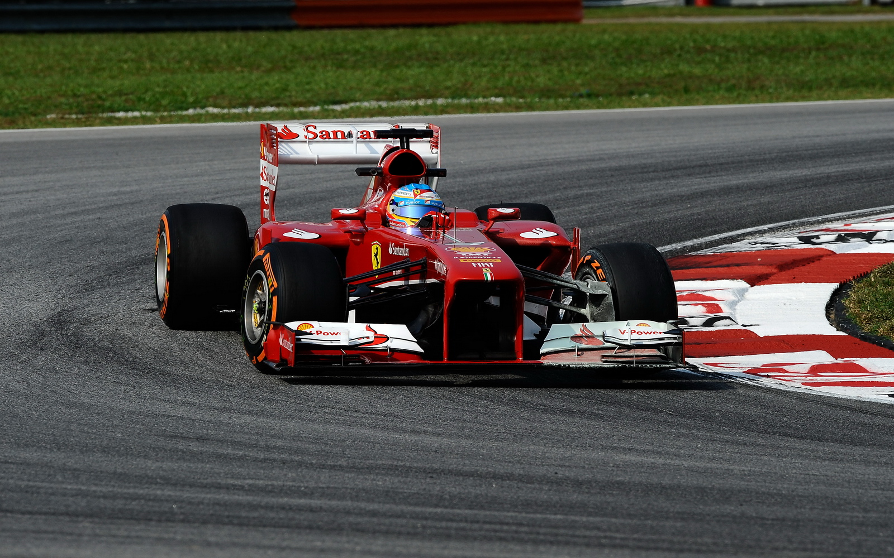

```{r install-package, include = FALSE, eval = FALSE}
# Copy and paste the following code into your console to download and install
# the `xaringan` package that contains all of the code which allows you 
# to create presentation slides in Rmarkdown
install.packages('xaringan')
```


```{r load-packages, include = FALSE}
# Add any additional packages you need to this chunk
library(tidyverse)
library(tidymodels)
library(palmerpenguins)
library(knitr)
library(xaringanthemer)
library(kableExtra)
style_mono_accent(base_color = "#1c5253", 
          header_font_google = google_font("Josefin Sans"),
          text_font_google   = google_font("Montserrat", "300", "300i"),
          code_font_google   = google_font("Fira Mono"))
```

```{r setup, include=FALSE}
# For better figure resolution
knitr::opts_chunk$set(fig.retina = 3, dpi = 300, fig.width = 6, fig.asp = 0.618, out.width = "65%")
```

```{r load-data, include=FALSE}
# Load your data here
FERR0 <- read_csv("data/formula_e_race_results.csv") %>%
  select(season, race_num, driver, points)
FERR <- FERR0 %>% 
  filter(points != 0)
```

class:inverse, center, middle

## Whether the more races a driver participates in,the higher the average points will be

---

##How to Win the Championship in Formula-E?

- The driver with the most points is the `driver's champion`.


```{r formula-e, echo = FALSE, out.width = "45%", fig.align = "center", fig.cap = "Image credit: Photo by Malaysian on MKFormula1."}

```
---

## Drivers' Championships in Seven Seasons

.pull-left[
```{r best-driver, echo=FALSE}
best_drivers_summary <- FERR %>%
  group_by(season, driver) %>%
  summarise(total_points = sum(points), .groups = 'drop') %>%
  group_by(season) %>%
  slice_max(order_by = total_points, n = 1) %>%
  ungroup() %>%
  select(season, driver, total_points)
x_html <- knitr:: kable(best_drivers_summary, "html", align = "l") %>%
                   kable_styling(bootstrap_options = "bordered",
                                 full_width = F, 
                                 font_size = 15) %>%
                    column_spec(1:3, bold = T, color = "#1F4257", background = "white")
x_html
```
]

```{r champions, echo = FALSE, out.width = "50%", fig.align='right', fig.cap = "Image credit: Photo on Formula E Chronicles 2022."}
include_graphics("img/champions.png")
```


---

##Example (Season 2)

```{r season_2_data(example), echo=FALSE}
season_2 <- FERR0 %>%
  filter(season == 2)
season_2_data <- season_2 %>%
  group_by(driver) %>%
  summarise(
    total_points = sum(points),
    average_points = mean(points),
    frequency = n()
    ) %>%
  arrange(desc(total_points)) 
y_html <- knitr:: kable(season_2_data, "html", align = "l") %>%
                   kable_styling(bootstrap_options = "basic",
                                 full_width = F, 
                                 font_size = 10) %>%
                    column_spec(1:4, bold = T, color = "#1F4257", background = "white")
y_html
```
---

class: inverse, center, middle
# Liner Regression Model

---

##A Boring Regression with Seven Seasons

```{r model1, echo=FALSE}
#frequency
freq <- 
  select(FERR0, driver)  %>% 
  table()
freq_driver1 <- as.data.frame(freq)

#average

avg_driver1 <- FERR0 %>%
  group_by(driver) %>%
  summarize(avg_points = mean(points, na.rm = TRUE))

freq_avg1 <- full_join(freq_driver1, avg_driver1, by = "driver")
```

```{r, boring regression}
single_re_fit1 <- linear_reg() %>%
  set_engine("lm") %>%
  fit(avg_points ~ Freq, data = freq_avg1)
tidy(single_re_fit1)
glance(single_re_fit1)$r.squared
```
---

##Plot
```{r, model1,visualize, echo=FALSE, fig.width=10}
model1 <- ggplot(data = freq_avg1, aes(x = Freq, y = avg_points)) + 
  geom_point() + 
  labs(title = "the relationship between average points and frequency in all seasons",
       x = "Frequency",
       y = "Average Points") +
  geom_smooth(method = "lm",
              se = FALSE)
model1 
```

---

##Only the First Six Seasons
```{r model2}
#freq filters season != 7 
freq <- 
  filter(FERR0, season != "7") %>%
  select(driver)  %>% 
  table()
freq_driver2 <- as.data.frame(freq)
#average filters season != 7
avg_driver2 <-
  filter(FERR0, season != 7 ) %>%
  group_by(driver) %>%
  summarize(avg_points = mean(points, na.rm = TRUE))
#filters season != 7
freq_avg2 <- left_join(freq_driver2, avg_driver2, by = "driver")

```

```{r model2, regression, echo=FALSE}
#fit model 2
single_re_fit2 <- linear_reg() %>%
  set_engine("lm") %>%
  fit(avg_points ~ Freq, data = freq_avg2)
tidy(single_re_fit2)
#r squared model2, indicating an improvement
glance(single_re_fit2)$r.squared
```
---

##Visualize Model (the first six seasons)

```{r,model2, visualize, echo=FALSE, fig.width=10}
model2 <- ggplot(data = freq_avg2, aes(x = Freq, y = avg_points)) + 
  geom_point() + 
   labs(title = "the relationship between average points and frequency in the first six seasons",
       x = "Frequency",
       y = "Average Points") +
  geom_smooth(method = "lm",
              se = FALSE)
model2
```
---
##Frequency>=3
```{r model3}
#freq filters freq >= 3
freq_driver3 <-
  freq_driver1 %>% filter (Freq >= 3)

#filters freq >= 3
freq_avg3 <- left_join(freq_driver3, avg_driver1, by = "driver")
```

```{r, model3, regression, echo=FALSE}
#fit model 3
single_re_fit3 <- linear_reg() %>%
  set_engine("lm") %>%
  fit(avg_points ~ Freq, data = freq_avg3)
tidy(single_re_fit3)
#r squared model3
glance(single_re_fit3)$r.squared
```

---
##Visualize Model(frequecny >=3)
```{r, model3, visualize, echo=FALSE, fig.width=10}
model3 <- ggplot(data = freq_avg3, aes(x = Freq, y = avg_points)) + 
  geom_point() + 
   labs(title = "the relationship among drivers whose frequency is greater than 3",
       x = "Frequency",
       y = "Average Points") +
  geom_smooth(method = "lm",
              se = FALSE)
model3
```
---
##the First Six Season and Frequency>=3
```{r model4}
#freq filters season != 7 and freq >= 3
freq_driver4 <-
  freq_driver2 %>% filter (Freq >= 3)
#average filters season != 7
avg_driver2 <-
  filter(FERR0, season != 7 ) %>%
  group_by(driver) %>%
  summarize(avg_points = mean(points, na.rm = TRUE))
#filters freq >= 3 and season != 7
freq_avg4 <- left_join(freq_driver4, avg_driver2, by = "driver")
```

```{r, model4,regression, echo=FALSE}
#fit model 4
single_re_fit4 <- linear_reg() %>%
  set_engine("lm") %>%
  fit(avg_points ~ Freq, data = freq_avg4)
tidy(single_re_fit4)
#r squared model4, indicating an improvement
glance(single_re_fit4)$r.squared

```
---

##the First Six Season and Frequency>=3
```{R, model4, visualize, echo=FALSE, fig.width=10}
model4 <- ggplot(data = freq_avg4, aes(x = Freq, y = avg_points)) + 
  geom_point() + 
  labs(title = "the relationship among drivers whose frequency is greater than 3 in the first six seasons",
       x = "Frequency",
       y = "Average Points") +
  geom_smooth(method = "lm",
              se = FALSE)


model4
```

---

#Evaluation
- the `inherent uncertainty` in sports competitions is strong.

- the resultant `sample size` after data filtering may be `limited`, potentially compromising the generalizability and fairness of the results. 

- The 0.53 r.square implies a discernible correlation between a driver's participation frequency and their average performance, signifying a relationship between  `participation frequency and skill level.` 

- The linear regression can show the relationship between independent variable and dependent variable  `straightforwardly`.

---

class:inverse, middle, center
#Thanks for listening
