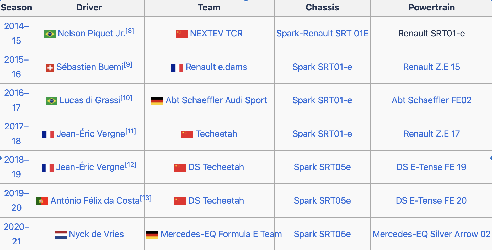

```{r setup, include = FALSE}
knitr::opts_chunk$set(echo = TRUE)
```


```{r load-lib, include = FALSE}
library(tidyverse)
library(dplyr)
library(ggplot2)
library(tidymodels)
library(knitr)


```

```{r load-data, include=FALSE}
FERR0 <- read_csv("data/formula_e_race_results.csv") %>%
  select(season, race_num, driver, points)
FERR <- FERR0 %>% 
  filter(points != 0)
```


## Research Question
The Formula E Championship, notorious for its unpredictability, is influenced by a myriad of factors such as driver expertise, car performance, circuit characteristics, and race formats, all contributing to its unforeseeable outcomes. This report aims to explore the relationship between XXX and XXX in the most impartial manner possible.

The report commences with a concise delineation of the methodology for curating pristine data, coupled with an exposition of the selected statistical models and the pertinent questions they are designed to address. Subsequently, tables, figures, summary values, and fitted models are presented in a clear and explanatory manner. The research then objectively highlights systematic and random errors found in the data, methodology, and practical implications, with proposed ethical solutions for systematic biases. Finally, the report addresses the research objectives and questions, offering responses based on the statistical analysis.


## Methods
1.the defination of the terminologies in the data set

"The initial step involved labeling the data as FERR0 and FERR. FERR0 retained four variables from the original dataset: 'season' (the nth racing season), 'race_num' (the mth race), 'driver' (the name of the driver), and 'points' (the total points for the mth race). FERR, on the other hand, was derived from FERR0 by filtering out all rows where the 'points' were zero."


The investigation process utilises packages tidyverse, tidymodels and ggplot2.

In the cleaning stage, functions select(), slice(), filter(), summarize() are used the most to manipulate and transform the original data into a tidy format. They also help merging information needed such as average points. As resulting, dataframes containing driver, total points, average points and frequency based on FERR0 are created to support further work. 

After obtaining the required data, linear regression is plotted between different variables to observe any potential relationship. This step is completed by using ggplot(). aes(x = Freq, y = avg_points). Function geom_point() implies a point diagram and geom_smooth(method = "lm", se = FALSE) provides the linear regression line and removes the shadow around it. By observing the visualizations, there could be some preliminary inspiration about the prediction. 

Based on the insights obtained from the previous stage, a more detailed investigation on the relationship between average total points and frequency (of attending races) has been carried out. Average total point refers to the average points each driver earns throughout races they attended, which largely reflects the racing level of these drivers. Frequency, on the other hand, indicates the number of competitions the drivers have participated in, which is correlated to the experience of these drivers. 

An initial model (model1) is plotted using linear_reg(), sets engine as "lm". Then the command fit() is piped, providing name of the data and relationship avg_points ~ Freq. By taking a look at outcome of the model, the estimate intercept and correlation between the pair of variables can be found.  

The original model is visualized by ggplot(). The function geom_point() tells R which type of diagram should be plotted. geom_smooth() provides visualization of the linear regression line as well. To improve the readability and aesthetics of the diagram, labs() is added as a layer, allowing the information to be presented clearly.  

Three models (model2/3/4) are derived from the original version. They respectively filters "season != 7", "Freq >= 3", "season != 7" and "Freq >= 3", supporting by derived dataframes, where filter(), group_by(), summarize() are applied to extract the needed information to satisfy various conditions. All the four models are evaluated by the r squared using the function glance()$r.squared. The closer the r squared value is to 1, the stronger the correlation between the x-y variables is. 

The visualization stage of derived model is similarly to the previous procedure. ggplot() completes the work. Point diagrams are plotted by geom_point().  geom_smooth(method = "lm", se = FALSE) is there to visualize the linear regression line. labs() layer is added as well to improve the presentation of the diagrams. 


## Data
1 list

"According to Fiaformulae, the champion of the Formula E Championship is determined by the driver with the highest cumulative points in the season. The following chart lists the drivers with the highest total points across seven seasons, comparing this data with the champion information provided by Formulaechronicles."
```{r, echo=FALSE}
best_drivers_summary <- FERR %>%
  group_by(season, driver) %>%
  summarise(total_points = sum(points), .groups = 'drop') %>%
  group_by(season) %>%
  slice_max(order_by = total_points, n = 1) %>%
  ungroup() %>%
  select(season, driver, total_points)
best_drivers_summary
```
```{r, echo=FALSE}

```


2.
"The report focuses on the 2nd season, identified as the most representative. New variables 'frequency' (number of races participated) and 'average_points' are added, as detailed in the list below."

```{r season_2_data(example), echo=FALSE}
season_2 <- FERR0 %>%
  filter(season == 2)
season_2_data <- season_2 %>%
  group_by(driver) %>%
  summarise(
    total_points = sum(points),
    average_points = mean(points),
    frequency = n()
    ) %>%
  arrange(desc(total_points)) 
season_2_data
```

model 1:

Model 1 is the relationship between average points and frequency of each driver in all 7 seasons.
```{r model1, echo=FALSE}
#frequency
freq <- 
  select(FERR0, driver)  %>% 
  table()
freq_driver1 <- as.data.frame(freq)

#average

avg_driver1 <- FERR0 %>%
  group_by(driver) %>%
  summarize(avg_points = mean(points, na.rm = TRUE))

freq_avg1 <- full_join(freq_driver1, avg_driver1, by = "driver")
multi_re_fit1 <- linear_reg() %>%
  set_engine("lm") %>%
  fit(avg_points ~ Freq, data = freq_avg1)

multi_re_fit1

model1 <- ggplot(data = freq_avg1, aes(x = Freq, y = avg_points)) + 
  geom_point() + 
  labs(title = "the relationship between average points and frequency in all seasons",
       x = "Frequency",
       y = "Average Points") +
  geom_smooth(method = "lm",
              se = FALSE)
model1 

#r squared of original model
glance(multi_re_fit1)$r.squared
```

model 2:

Model 2 is the relationship between average points and frequency of each driver in the first six seasons.We removed the data for the seventh season because it has a significant gap compared to the previous six seasons.
```{r model2, echo=FALSE}
#freq filters season != 7 
freq <- 
  filter(FERR0, season != "7") %>%
  select(driver)  %>% 
  table()
freq_driver2 <- as.data.frame(freq)

#average filters season != 7
avg_driver2 <-
  filter(FERR0, season != 7 ) %>%
  group_by(driver) %>%
  summarize(avg_points = mean(points, na.rm = TRUE))


#filters season != 7
freq_avg2 <- left_join(freq_driver2, avg_driver2, by = "driver")
#filters freq >= 3

#fit model 2
multi_re_fit2 <- linear_reg() %>%
  set_engine("lm") %>%
  fit(avg_points ~ Freq, data = freq_avg2)

#r squared model2, indicating an improvement
glance(multi_re_fit2)$r.squared

multi_re_fit2

#visualize model2
model2 <- ggplot(data = freq_avg2, aes(x = Freq, y = avg_points)) + 
  geom_point() + 
   labs(title = "the relationship between average points and frequency in the first six seasons",
       x = "Frequency",
       y = "Average Points") +
  geom_smooth(method = "lm",
              se = FALSE)
model2

#r squared model2, indicating an improvement
glance(multi_re_fit2)$r.squared
```

model 3:

Model 3 is the relationship between average points and frequency among drivers whose frequency is greater than 3.We removed the data of drivers who Participated in less than three matches in a season to minimize uncertainty as much as possible.
```{r model3, echo=FALSE}

#freq filters freq >= 3
freq_driver3 <-
  freq_driver1 %>% filter (Freq >= 3)

#filters freq >= 3
freq_avg3 <- left_join(freq_driver3, avg_driver1, by = "driver")

#fit model 3
multi_re_fit3 <- linear_reg() %>%
  set_engine("lm") %>%
  fit(avg_points ~ Freq, data = freq_avg3)

multi_re_fit3

#visualize model3
model3 <- ggplot(data = freq_avg3, aes(x = Freq, y = avg_points)) + 
  geom_point() + 
   labs(title = "the relationship among drivers whose frequency is greater than 3",
       x = "Frequency",
       y = "Average Points") +
  geom_smooth(method = "lm",
              se = FALSE)
model3

#r squared model3
glance(multi_re_fit3)$r.squared
```

model 4:

Model 4 is the relationship between average points and frequency among drivers whose frequency is greater than 3 in the first six seasons.In other words, Model 4 is generated by combining the conditions of Model 2 and Model 3.
```{r model4, echo=FALSE}

#freq filters season != 7 and freq >= 3
freq_driver4 <-
  freq_driver2 %>% filter (Freq >= 3)

#average filters season != 7
avg_driver2 <-
  filter(FERR0, season != 7 ) %>%
  group_by(driver) %>%
  summarize(avg_points = mean(points, na.rm = TRUE))

#filters freq >= 3 and season != 7
freq_avg4 <- left_join(freq_driver4, avg_driver2, by = "driver")

#fit model 4
multi_re_fit4 <- linear_reg() %>%
  set_engine("lm") %>%
  fit(avg_points ~ Freq, data = freq_avg4)

multi_re_fit4

#visualize model 4
model4 <- ggplot(data = freq_avg4, aes(x = Freq, y = avg_points)) + 
  geom_point() + 
  labs(title = "the relationship among drivers whose frequency is greater than 3 in the first six seasons",
       x = "Frequency",
       y = "Average Points") +
  geom_smooth(method = "lm",
              se = FALSE)


model4

#r squared model4, indicating an improvement
glance(multi_re_fit4)$r.squared
```
## Findings
Analysis: Figure 1.1 illustrates the computation of the highest-scoring driver for each season, which was subsequently compared with online-searched driver championship data spanning from 2014 to 2017. It was observed that the highest scorer in each season consistently held the championship title. Using the second season as an exemplar, the correlation between a driver's participation frequency and their average and total scores was explored. The analysis revealed that, as a driver's participation frequency increased, there was an observable trend towards higher average scores, indicative of an elevated skill level. This observation led to the formulation of a hypothesis positing that an increase in a driver's participation frequency would correspond to a higher average score. To test this hypothesis, a linear model encompassing seven seasons was constructed to examine the relationship between a driver's participation frequency and their average score. The initial model exhibited notable data dispersion with numerous outliers, resulting in a relatively low R-squared value of 0.44. To address this, a refined data filtering process was employed, wherein only drivers who participated in three or more races were included, resulting in reduced outliers and a discernible increase in the R-squared value. Further refinement involved excluding data from the seventh season due to the impact of the COVID-19 pandemic, as several drivers abstained from participating, rendering the season's data less representative. With this adjustment, the model demonstrated increased concentration, yielding an elevated R-squared value of 0.53. This implies a discernible correlation between a driver's participation frequency and their average performance, signifying a relationship between participation frequency and skill level. However, it is crucial to acknowledge that while increased participation may contribute to enhanced experience and potentially improved skills, it may also coincide with aging and a potential decline in athletic performance. Additionally, the inherent uncertainty in sports competitions contributes to the moderate strength of the relationship between participation frequency and average performance.
Evaluation and Limitations: During the data filtering process, emphasis was placed on excluding non-representative data without the incorporation of random selection. Furthermore, the resultant sample size after data filtering may be limited, potentially compromising the generalizability and fairness of the results. In constructing the model, consideration was given to only one influencing factor on average scores, despite the likelihood of multiple factors influencing the outcomes.

## References

Formula E Chronicles 2022, Formula E Champions, Formula E Chronicles, viewed 30 Nov 2023, <https://formulaechronicles.com/list-of-formula-e-champions/#:~:text=Points%20are%20awarded%20based%20on,the%20respective%20championship%20or%20trophy>.

Formula E Wiki, S n.d., 2019/20 Formula E Championship, Formula E Wiki, viewed 30 Nov 2023, <https://formulae.fandom.com/wiki/2019/20_Formula_E_Championship>.

MLANDRY 2021, Formula E Championship, Kaggle, viewed 30 Nov 2023, <https://www.kaggle.com/datasets/mlandry/formula-e-championship>.

The Official Home of Formula E, S n.d., Rules and Regulations, The Official Home of Formula E, viewed 30 Nov 2023, <https://www.fiaformulae.com/en/championship/rules-and-regulations#:~:text=Championship%20and%20standings,most%20points%20over%20the%20season.>.